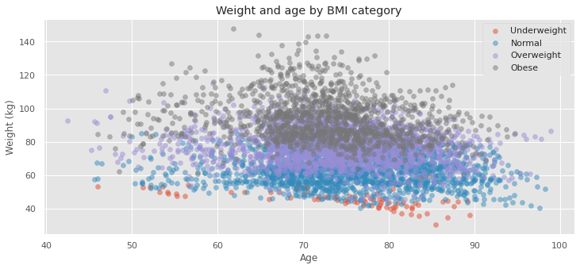

# The data science analytical cycle

There are many steps in an analytical project, and one person is rarely responsible for all stages of the project throughout its entire life cycle. 
It is more common that different stages will be assigned to other people with complementary skills.  The likelihood of the project being successful increases if you create an easy-to-understand and extendable pipeline from the beginning. 


## Cleaning real data 
Today's session is all about the real world. 
Our primary goal in any analytical project is to create a framework that is:
1. Easy to extend 
1. Reproducible 
1. Computationally efficient 
1. and Transparent

## The simple framework 
Last week, we ended with a simple load_data pipeline.
Let's examine the logic behind this framework first.
The function is simple and logically divided into three parts. 

1. Construct a name for the file based on the defined stage 
1. Verify the existence of the file 
    - If found, the data in the file is loaded (unless explicitly instructed not to)
    - If not, it executes the processing stages you specify that returns processed data. 
1. Finally, return data. 

```python
def load_data(stage,input_path,input_name,reapply=False):

  input_file = f'{input_path}/{stage}_{input_name}.pkl'
  if not reapply and Path(input_file).exists():
    data = load_pickle(input_file)
  else:
    data = {'some_stage': process_some_stage}[stage](input_file)
    
  return data
```

## Let's make this work

I must create two explicit (and one implicit) supporting functions for this framework to be practical
- I need to create a `load_pickle()` function  
- I also need to create a `process_some_stage()` function 
- And I assume that `process_some_stage()` needs to save a pickle so we might as well create a `save_pickle()` function

## What is a pickle 

Module for (de)serialization. i.e. storing complete Python objects into binary files. 
- It supports almost any data structure 
- It works only with python


# Loading Pickles 

```python
import _pickle as cPickle #use this function it is faster than most

def load_pickle(input_name):
    input_pickle = open(input_name, 'rb')
    data = cPickle.load(input_pickle)
    input_pickle.close()
    return data
```
1. We start by opening a file called `input_name` the `rb` mode opens the file in binary format for reading.
1. We load the contents of the `input_pickle` into the variable data. 
1. We close the open pointer to the file on the disk 
1. and return the data 

# Saving Pickles 

```python
def save_pickle(output_name,data):
    if not Path(output_name).exists():
        Path(Path(filename).absolute().parent).mkdir(parents=True, exist_ok=True)
    output_pickle = open(output_name, "wb")
    cPickle.dump(data, output_pickle)
    output_pickle.close()
```
1. We start by checking that the path the output_name point for exists.
   - If it doesn't we make it 
1. We then open a file named output_name the `wb` mode opens the file in binary format for writing. 
1. We dump the data into our output_pickle to save on the disk 
1. We finish by closing the pointer to the file 

# What does process_some_stage do ? 
Rename this function to `download_data()`
We used it before, and now it is easy to understand; it just downloads files as a data frame contained in a dictionary. We downloaded these as separate CSV files in our example. To gain knowledge of both of these formats, today, we will use pickle files. 


```python
def download_data(input_file):
  data = {}
  for d in ["ADRCClinicalData",'FreeSurfers','SubDemos',"subjects"]:
    url = f'https://raw.githubusercontent.com/esoreq/Real_site/master/data/{d}.csv'
    data[d] = pd.read_csv(url)
  save_pickle(input_file,data)  
  return data 
```

## Change your load_data 
Once everything exists, we just change our function to point to the right functions

```python
def load_data(stage,input_path,input_name,reapply=False):

  input_file = f'{input_path}/{stage}_{input_name}.pkl'
  if not reapply and Path(input_file).exists():
    data = load_pickle(input_file)
  else:
    data = {'raw': download_data}[stage](input_file)
    
  return data
```

## Test that it works  


```python
%%time
data = load_data('raw','../Data','oasis3',reapply=True)
```

    CPU times: user 277 ms, sys: 54.9 ms, total: 332 ms
    Wall time: 1.93 s


```python
data.keys()
```


    dict_keys(['ADRCClinicalData', 'FreeSurfers', 'SubDemos', 'subjects'])


```python
%%time
data = load_data('raw','../Data','oasis3',reapply=False)
```

    CPU times: user 3.15 ms, sys: 1.72 ms, total: 4.87 ms
    Wall time: 16.6 ms


## Let's extend this pipeline to clean some data  

- We need a function that will automatically drop any column that has less than 90% missing observations
- Again, this calls for two explicit functions 
  - One to detect and quantify missing observations (NB this step assumes we identified and codded nans correctly)
  - Another to drop columns based on a threshold 
- Importantly, this function will have some hidden assumptions (i.e. it will not generalise to any data set, only data frames contained within a dictionary) 

## Let's make this work

- We start with the missing profile function from last week 

```python
def missing_profile(x):
  d = {} 
  d['notnull'] = x.notnull().sum()
  d['isnull'] = x.isnull().sum()
  d['%missing'] = d['isnull']/x.shape[0]
  return pd.Series(d, index=d.keys())
```

## Drop missing columns logic
- To obtain the columns' missing values, we apply the missing_profile(x)* function
- Together with a threshold, we identify columns to be dropped
- If there are any columns to drop, we remove them 

```python
def drop_missing_columns(df,thr):
    _df = df.apply(missing_profile).T
    columns_2_drop = _df[_df['%missing']>thr]
    if not columns_2_drop.empty:
      df = df.drop(columns=columns_2_drop.index)
    return df,columns_2_drop 
```  

## Combine evrything in the top function
- We assume that an intermediate raw file exists, even though this function can be applied to data files rather than paths.
- The file is then loaded using the *load_pickle()* method 
- Then, for each dataset contained within the dictionary, it drops the columns that are missing 
- It ends with a pkl file containing a cleaned dataset 

```python
def clean_data(output_file,thr = 0.9):
  input_file = output_file.replace('clean','raw')
  data = load_pickle(input_file)
  dropped = {}
  for k in data.keys():
      data[k],dropped[k] = drop_missing_columns(data[k],thr)
  save_pickle(output_file,data)
  return data,dropped  
```

## Extend your load_data function
Now we just add a stage to our `load_data` function to excute the new function

```python
def load_data(stage,input_path,input_name,reapply=False):

  input_file = f'{input_path}/{stage}_{input_name}.pkl'
  if not reapply and Path(input_file).exists():
    data = load_pickle(input_file)
  else:
    data = {'raw': download_data,
            'clean': clean_data}[stage](input_file)
    
  return data
```

## Test that it works  


```python
%%time
data,dropped = load_data('clean','../Data','oasis3',reapply=True)
```

    CPU times: user 98.7 ms, sys: 2.79 ms, total: 102 ms
    Wall time: 124 ms


```python
for k in dropped.keys():
  _ = dropped[k]
  display(Markdown(f'### In Dataset **{k}** we removed {_.shape[0]} columns'))
  display(_)
```


### In Dataset **ADRCClinicalData** we removed 5 columns


<div>
<style scoped>
    .dataframe tbody tr th:only-of-type {
        vertical-align: middle;
    }

    .dataframe tbody tr th {
        vertical-align: top;
    }

    .dataframe thead th {
        text-align: right;
    }
</style>
<table border="1" class="dataframe">
  <thead>
    <tr style="text-align: right;">
      <th></th>
      <th>notnull</th>
      <th>isnull</th>
      <th>%missing</th>
    </tr>
  </thead>
  <tbody>
    <tr>
      <th>Date</th>
      <td>0.0</td>
      <td>6224.0</td>
      <td>1.0</td>
    </tr>
    <tr>
      <th>Age</th>
      <td>0.0</td>
      <td>6224.0</td>
      <td>1.0</td>
    </tr>
    <tr>
      <th>acsparnt</th>
      <td>0.0</td>
      <td>6224.0</td>
      <td>1.0</td>
    </tr>
    <tr>
      <th>primStudy</th>
      <td>0.0</td>
      <td>6224.0</td>
      <td>1.0</td>
    </tr>
    <tr>
      <th>acsStudy</th>
      <td>0.0</td>
      <td>6224.0</td>
      <td>1.0</td>
    </tr>
  </tbody>
</table>
</div>


### In Dataset **FreeSurfers** we removed 2 columns


<div>
<style scoped>
    .dataframe tbody tr th:only-of-type {
        vertical-align: middle;
    }

    .dataframe tbody tr th {
        vertical-align: top;
    }

    .dataframe thead th {
        text-align: right;
    }
</style>
<table border="1" class="dataframe">
  <thead>
    <tr style="text-align: right;">
      <th></th>
      <th>notnull</th>
      <th>isnull</th>
      <th>%missing</th>
    </tr>
  </thead>
  <tbody>
    <tr>
      <th>FS Date</th>
      <td>0.0</td>
      <td>2047.0</td>
      <td>1.0</td>
    </tr>
    <tr>
      <th>Included T1s</th>
      <td>0.0</td>
      <td>2047.0</td>
      <td>1.0</td>
    </tr>
  </tbody>
</table>
</div>


### In Dataset **SubDemos** we removed 15 columns


<div>
<style scoped>
    .dataframe tbody tr th:only-of-type {
        vertical-align: middle;
    }

    .dataframe tbody tr th {
        vertical-align: top;
    }

    .dataframe thead th {
        text-align: right;
    }
</style>
<table border="1" class="dataframe">
  <thead>
    <tr style="text-align: right;">
      <th></th>
      <th>notnull</th>
      <th>isnull</th>
      <th>%missing</th>
    </tr>
  </thead>
  <tbody>
    <tr>
      <th>Date</th>
      <td>0.0</td>
      <td>4089.0</td>
      <td>1.000000</td>
    </tr>
    <tr>
      <th>Age</th>
      <td>0.0</td>
      <td>4089.0</td>
      <td>1.000000</td>
    </tr>
    <tr>
      <th>REFERX</th>
      <td>0.0</td>
      <td>4089.0</td>
      <td>1.000000</td>
    </tr>
    <tr>
      <th>BIRTHMO</th>
      <td>0.0</td>
      <td>4089.0</td>
      <td>1.000000</td>
    </tr>
    <tr>
      <th>BIRTHYR</th>
      <td>0.0</td>
      <td>4089.0</td>
      <td>1.000000</td>
    </tr>
    <tr>
      <th>HISPOR</th>
      <td>6.0</td>
      <td>4083.0</td>
      <td>0.998533</td>
    </tr>
    <tr>
      <th>HISPORX</th>
      <td>0.0</td>
      <td>4089.0</td>
      <td>1.000000</td>
    </tr>
    <tr>
      <th>RACEX</th>
      <td>0.0</td>
      <td>4089.0</td>
      <td>1.000000</td>
    </tr>
    <tr>
      <th>RACESECX</th>
      <td>0.0</td>
      <td>4089.0</td>
      <td>1.000000</td>
    </tr>
    <tr>
      <th>RACETERX</th>
      <td>0.0</td>
      <td>4089.0</td>
      <td>1.000000</td>
    </tr>
    <tr>
      <th>PRIMLANX</th>
      <td>0.0</td>
      <td>4089.0</td>
      <td>1.000000</td>
    </tr>
    <tr>
      <th>LIVSITX</th>
      <td>0.0</td>
      <td>4089.0</td>
      <td>1.000000</td>
    </tr>
    <tr>
      <th>RESIDENX</th>
      <td>0.0</td>
      <td>4089.0</td>
      <td>1.000000</td>
    </tr>
    <tr>
      <th>ZIP</th>
      <td>0.0</td>
      <td>4089.0</td>
      <td>1.000000</td>
    </tr>
    <tr>
      <th>MARISTAX</th>
      <td>0.0</td>
      <td>4089.0</td>
      <td>1.000000</td>
    </tr>
  </tbody>
</table>
</div>


### In Dataset **subjects** we removed 1 columns


<div>
<style scoped>
    .dataframe tbody tr th:only-of-type {
        vertical-align: middle;
    }

    .dataframe tbody tr th {
        vertical-align: top;
    }

    .dataframe thead th {
        text-align: right;
    }
</style>
<table border="1" class="dataframe">
  <thead>
    <tr style="text-align: right;">
      <th></th>
      <th>notnull</th>
      <th>isnull</th>
      <th>%missing</th>
    </tr>
  </thead>
  <tbody>
    <tr>
      <th>YOB</th>
      <td>0.0</td>
      <td>1098.0</td>
      <td>1.0</td>
    </tr>
  </tbody>
</table>
</div>


## Let's extend again this pipeline to process a specific dataset
This approach is particularly appealing at this point; we can create a function (or a set of related functions) to process a dataset in a way that is simple to extend, easy to understand, and enables us to test the assumptions made as we analyze the data.

## We will start with the ADRC (Alzheimer’s Disease Research Center) clinical dataset
- Over this course, we will touch each of the four files we downloaded, and at the end, you will also get three unseen additional files to make your life interesting...
- However, for now, we will start with the clinical dataset, as it is complex and contains a number of potential research avenues.
- Examining the info, we want to create a function that loads the dataset from the clean data on the disk and returns a dataset containing age and BMI 


```python
data['ADRCClinicalData'].info()
```

    <class 'pandas.core.frame.DataFrame'>
    RangeIndex: 6224 entries, 0 to 6223
    Data columns (total 20 columns):
     #   Column                    Non-Null Count  Dtype  
    ---  ------                    --------------  -----  
     0   ADRC_ADRCCLINICALDATA ID  6224 non-null   object 
     1   Subject                   6224 non-null   object 
     2   mmse                      6052 non-null   float64
     3   ageAtEntry                6224 non-null   float64
     4   cdr                       6224 non-null   float64
     5   commun                    6216 non-null   float64
     6   dx1                       6222 non-null   object 
     7   dx2                       6211 non-null   object 
     8   dx3                       6211 non-null   object 
     9   dx4                       6211 non-null   object 
     10  dx5                       6211 non-null   object 
     11  homehobb                  6216 non-null   float64
     12  judgment                  6216 non-null   float64
     13  memory                    6216 non-null   float64
     14  orient                    6215 non-null   float64
     15  perscare                  6216 non-null   float64
     16  apoe                      6168 non-null   float64
     17  sumbox                    6216 non-null   float64
     18  height                    4965 non-null   float64
     19  weight                    5745 non-null   float64
    dtypes: float64(13), object(7)
    memory usage: 972.6+ KB


# Step 1. load data 


```python
def process_bmi(output_file):
  # load cleaned data from disk
  
  
```

> ## Solution 
> > ~~~python
def process_bmi(output_file):
  # load cleaned data
  input_file = output_file.replace('bmi','clean')
  data = load_pickle(input_file)
  df = data['ADRCClinicalData']
  del data  
> > ~~~
{: .solution}


# Step 2. extract only task-relevant columns
Determine the most important columns from the info output

```python
def process_bmi(output_file):
  # ...
  # extract only task-relevant columns
```

> ## Solution 
> > ~~~python
def process_bmi(output_file):
  # ...
  df = df.iloc[:,[0,1,3,18,19]] 
  # rename columns for simplicity 
  df.columns = ['pid','subj','age_at_entry','height','weight']
> > ~~~
{: .solution}


# Step 3. Estimate age  
We covered this at the end of the bootcamp 

```python
def process_bmi(output_file):
  # ...
  # ...
  # Estimate age  
```

> ## Solution 
> > ~~~python
def process_bmi(output_file):
  # extract days_since_entry
  df['days_since_entry'] = df['pid'].apply(lambda x: int(x.split('_')[-1][1:]))
  df['age'] = df['days_since_entry']/365 + df['age_at_entry']
> > ~~~
{: .solution}

# Step 4. Transform from Imperial to metric
We will also convert the data from Imperial to metric as part of the function as the height and weight are in imperial measurements.

```python
def process_bmi(output_file):
  # ...
  # ...
  # transform from Imperial to metric
```

> ## Solution 
> > ~~~python
def process_bmi(output_file):
  # transfrom from inch to meters
  df['height'] = df['height']*0.0254 
  # transfrom from pounds to kg
  df['weight'] = df['weight']*0.453592 
> > ~~~
{: .solution}


# Step 5. Calculate BMI
BMI is a person's weight in kilograms divided by the square of height in meters. A high BMI can indicate high body fatness.

```python
def process_bmi(output_file):
  # ...
  # ...
  # calculate bmi
```

> ## Solution 
> > ~~~python
def process_bmi(output_file):
  df['bmi'] = df['weight']/(df['height']**2)
> > ~~~
{: .solution}


# Step 6. Categorize BMI
Commonly accepted BMI ranges are underweight (under 18.5 kg/m^2), normal weight (18.5 to 25), overweight (25 to 30), and obese (over 30).

```python
def process_bmi(output_file):
  # ...
  # categorize bmi
```

> ## Solution 
> > ~~~python
def process_bmi(output_file):
  bins=[0,18.5,25,30,60]
  labels=['Underweight','Normal','Overweight','Obese']
  df['bmi_cat'] = pd.cut(df['bmi'],bins,labels=labels)
> > ~~~
{: .solution}

# Step 7. Save output file as pickle and return a DataFrame
Save output as pickle 

```python
def process_bmi(output_file):
  # ...
  # save output 
```

> ## Solution 
> > ~~~python
def process_bmi(output_file):
  save_pickle(output_file,df)
  return df 
> > ~~~
{: .solution}


# The `process_bmi` function 
Here is the complete function without comments 

> ## Solution 
> > ~~~python
def process_bmi(output_file):
  input_file = output_file.replace('bmi','clean')
  data = load_pickle(input_file)
  df = data['ADRCClinicalData']
  del data
  df = df.iloc[:,[0,1,3,18,19]] 
  df.columns = ['pid','subj','age_at_entry','height','weight']
  df['days_since_entry'] = df['pid'].apply(lambda x: int(x.split('_')[-1][1:]))
  df['age'] = df['days_since_entry']/365 + df['age_at_entry']
  df['height'] = df['height']*0.0254 # transfrom from inch to meters
  df['weight'] = df['weight']*0.453592 # transfrom from pounds to kg
  df['bmi'] = df['weight']/(df['height']**2) # calculate bmi
    bins=[0,18.5,25,30,60] # categorize bmi
  labels=['Underweight','Normal','Overweight','Obese']
  df['bmi_cat'] = pd.cut(df['bmi'],bins,labels=labels)
  save_pickle(output_file,df)
  return df 
> > ~~~
{: .solution}


# Test it 

```python
%%time
data = load_data('bmi',reapply=True)
fig,ax = plt.subplots(figsize=(12,5))
for name,group in data.groupby('bmi_cat'):
  ax.scatter(group['age'],group['weight'],label=name,alpha=0.5)
ax.update({'xlabel':'Age', 'ylabel':'Weight (kg)',
           'title':'Weight and age by BMI category'}) 
ax.legend()
```


The focus of this week was to teach you how to build a modular pipeline to organize your preprocessing steps in a reproducible and transparent manner. You can experiment with this approach and apply it to other aspects of this data set, other datasets, and your own. The topic of feature engineering and domain expertise will be discussed next week.
