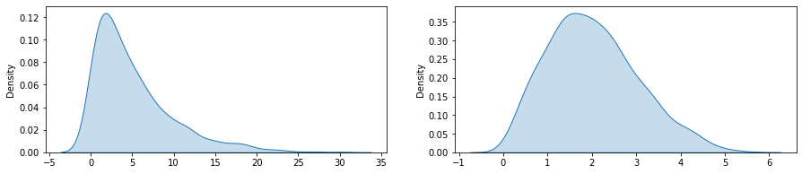
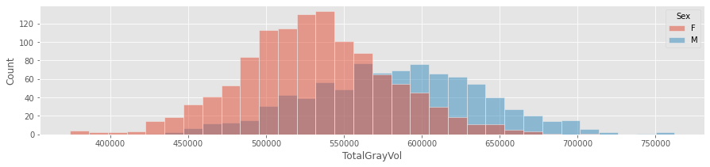
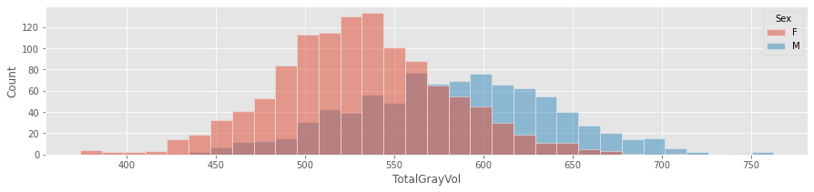
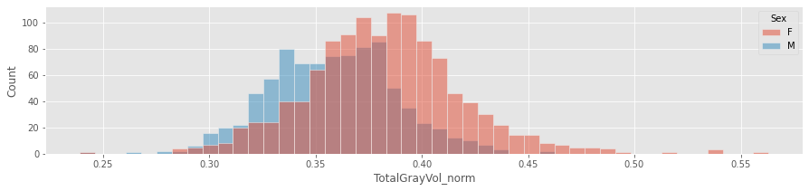

# The data science analytical cycle

Let's review the data science analytical cycle


## Feature engineering: what is it?

The ideal machine learning dataset is a tabular one. Each row represents a unique observation, while each column represents anything relevant collected or created to study the observed phenomenon. These columns are called features or variables, and they are hopefully related to the studied process. To effectively train and calibrate algorithms, choosing appropriate features is a crucial step.

In a machine learning project we always start with collecting and cleaning our data a process that can take some time. However, even "clean" data requires some moderating before being investigated with a model. In the feature engineering stage we convert the raw dataset into a feature space via extraction, selection, transformation and construction of relevant features.

When it comes to building your ML project, this is often the most challenging and longest phase. To begin with, you start with raw data and use your domain knowledge to generate features that will help your machine learning algorithms perform well. The goal at this stage is to construct features that represent the problem that you wish to investigate. The best way to improve your model's accuracy on new data is to add better features, and this some times calles for creativity and/or domain expertise.

We discussed several feature engineering methods without labelling them as such.
The previous topic showed how to filter columns with missing information; Btw it will not come as a huge surprise to learn that the same approach can be used for rows and filter out observations with incomplete feature sets. Whenever we remove features that contain missing information, we are actually reducing the dimensionality of our feature space, a process that is commonly referred to as feature selection.


## Feature selection

Feature selection involves picking a subset of the original features in order to reduce the feature space to an optimal level according to a predefined standard. As a result of feature selection in machine learning, the dimensionality of the feature space is reduced, which can speed up the training process and increase both the performance and interpretability of the predictive model. 

There are many ways to select features in machine learning. During the data mining stage (where we are) we are either in an exploratory mode to explore the possibilities of the dataset or in a confirmatory mode to answer specific questions. Regardless of the stage, we need a way to evaluate our features. An evaluation criterion may be as simple as the percentage of features missing or may be more complex, examining the potential for knowledge to be gained from the feature. This can be achieved using various statistical and learning approaches. 

We will dive into different feature selection methods when we will cover supervised models in two weeks from now.

## Feature extraction

Feature extraction is a process of reducing the dimensionality of a dataset. Feature extraction involves combining the existing features into new ones, thereby reducing the number of features in the dataset. This process reduces the amount of data into manageable sizes for algorithms to process without distorting the original relationships or relevant information.

We will dive into different feature extraction methods when we will cover unsupervised dimensionality reduction models next week.

## Feature Scaling and Centering
Often, we have datasets with different units of measurement for different features - For example, bodyweight is often expressed in kilograms (but not always), while brain volume is expressed as millimetres cubed with measures reaching millions. Similarly, we can include features such as response time, which can range from 400ms to 10 minutes, and even more; or age, which can range from 0 to 120 years old. Thus, brain volume is about 10,000 times greater than age. 

It is reasonable to assume that both variables are treated equally in the model, but how do we know? When these features are fed into the model as they are, it is likely that the brain volume will have a larger impact on the result. This doesn't necessarily mean it's more important as a predictor. Consequently, when we look at age and brain volume together, we need to scale them to some standard range.

### mean centering 
There are many different types of feature transformation, but the most basic one is centring a real-valued feature by subtracting its sample mean from all values (this can be done at the subject, group or sample level).

$$\hat{x} = \frac{1}{N}\sum^N_{i=1}x_i$$


```python
rng = np.random.default_rng(seed = 2021)
x = rng.uniform(5,10,size=5)
df = pd.DataFrame([x,x-np.mean(x),x-np.sum(x)/x.size]).T
df.columns=['$$x_i$$','$$x_i-\hat{x}$$',r'$$x_i-\frac{1}{N}*\sum^N_{i=1}x_i$$']
df
```


<div>
<style scoped>
    .dataframe tbody tr th:only-of-type {
        vertical-align: middle;
    }

    .dataframe tbody tr th {
        vertical-align: top;
    }

    .dataframe thead th {
        text-align: right;
    }
</style>
<table border="1" class="dataframe">
  <thead>
    <tr style="text-align: right;">
      <th></th>
      <th>$$x_i$$</th>
      <th>$$x_i-\hat{x}$$</th>
      <th>$$x_i-\frac{1}{N}*\sum^N_{i=1}x_i$$</th>
    </tr>
  </thead>
  <tbody>
    <tr>
      <th>0</th>
      <td>8.784739</td>
      <td>0.549031</td>
      <td>0.549031</td>
    </tr>
    <tr>
      <th>1</th>
      <td>9.706909</td>
      <td>1.471201</td>
      <td>1.471201</td>
    </tr>
    <tr>
      <th>2</th>
      <td>7.962315</td>
      <td>-0.273393</td>
      <td>-0.273393</td>
    </tr>
    <tr>
      <th>3</th>
      <td>6.594209</td>
      <td>-1.641500</td>
      <td>-1.641500</td>
    </tr>
    <tr>
      <th>4</th>
      <td>8.130369</td>
      <td>-0.105339</td>
      <td>-0.105339</td>
    </tr>
  </tbody>
</table>
</div>


### Data standardisation
Standardizing is is just changing the units so they are in "standard deviation" units. After standardization, a value of 1.5 means "1.5 standard deviations above 0". If the standard deviation were 8, this would be equivalent to saying "12 points above 0". you can see that while these are similar they are not identical.


```python
sd = np.std(x)
df[r'$$\frac{x_i-\hat{x}}{s_x}$$']=(x-np.mean(x))/sd
df
```


<div>
<style scoped>
    .dataframe tbody tr th:only-of-type {
        vertical-align: middle;
    }

    .dataframe tbody tr th {
        vertical-align: top;
    }

    .dataframe thead th {
        text-align: right;
    }
</style>
<table border="1" class="dataframe">
  <thead>
    <tr style="text-align: right;">
      <th></th>
      <th>$$x_i$$</th>
      <th>$$x_i-\hat{x}$$</th>
      <th>$$x_i-\frac{1}{N}*\sum^N_{i=1}x_i$$</th>
      <th>$$\frac{x_i-\hat{x}}{s_x}$$</th>
    </tr>
  </thead>
  <tbody>
    <tr>
      <th>0</th>
      <td>8.784739</td>
      <td>0.549031</td>
      <td>0.549031</td>
      <td>0.535992</td>
    </tr>
    <tr>
      <th>1</th>
      <td>9.706909</td>
      <td>1.471201</td>
      <td>1.471201</td>
      <td>1.436261</td>
    </tr>
    <tr>
      <th>2</th>
      <td>7.962315</td>
      <td>-0.273393</td>
      <td>-0.273393</td>
      <td>-0.266900</td>
    </tr>
    <tr>
      <th>3</th>
      <td>6.594209</td>
      <td>-1.641500</td>
      <td>-1.641500</td>
      <td>-1.602515</td>
    </tr>
    <tr>
      <th>4</th>
      <td>8.130369</td>
      <td>-0.105339</td>
      <td>-0.105339</td>
      <td>-0.102837</td>
    </tr>
  </tbody>
</table>
</div>


## Feature transformation
It is possible for some features to follow a skew distribution, in which only a small subset of samples is orders of magnitude smaller than the majority of the data (i.e., skew). In these cases, power transformations can sometimes be used to fix the problem. 


```python
x = rng.exponential(5,size=1000)
import seaborn as sns
import matplotlib.pyplot as plt
fig,ax = plt.subplots(1,2,figsize=(15,3))
sns.kdeplot(x,ax=ax[0],fill=True)
sns.kdeplot(x**0.5,ax=ax[1],fill=True)
```


    <AxesSubplot:ylabel='Density'>


    

    


## Feature construction  - building new features manually from raw data

The process of feature construction involves creating a new set of features. 
As an example, the BMI (Body Mass Index) feature we calculated last week can be derived using a mathematical formula on the existing features of height and weight.
These features are typically created manually (but not always), and you must devote a lot of time to working with real data (not aggregates) and to determining how best to expose the problem structure to your predictive modeling algorithm.


## Feature construction is an Art

You, the researcher, must come up with creative ways to create the features in order to achieve the best results. You also need to convert your input into something that an algorithm can comprehend. There are well-defined procedures that are methodical, provable, and easy to understand. However, the data is variable and changes with each problem. As you practice, you become better at deciding when to use certain procedures and how to execute them. Feature engineering can only be mastered through hands-on practice, and by studying what others who are doing well do.


## Two types of feature construction
The construction of new features can be divided into two types: 
1. data-driven, 
1. knowledge-based.

## Data-driven feature construction
With a data-driven approach, new features are constructed by analysing available data and applying various operators to it

## knowledge-based feature construction
Knowledge-based approaches create new features by combining existing knowledge with other domain knowledge.

# Let's explore some real cases using our Oasis-3 dataset

### Like always start by importing some packages 


```python
import numpy as np
import pandas as pd
import seaborn as sns
import matplotlib.pyplot as plt
import sys

sys.path.append("../")
from Code import preprocessing as pp
%load_ext autoreload
%autoreload 2
plt.style.use('ggplot')
```

This should raise an error since you do not have either the Python file preprocessing module or the Code module. 
To fix this let's start by downloading the preprocessing.py file using `wget` and placing it inside the folder `Code`.


```bash
%%bash 
mkdir -p ../Code
wget https://esoreq.github.io/esoreq_personal/files/preprocessing.py -P ../Code/
```

    --2021-07-06 10:54:57--  https://esoreq.github.io/esoreq_personal/files/preprocessing.py
    Resolving esoreq.github.io (esoreq.github.io)... 185.199.110.153, 185.199.109.153, 185.199.108.153, ...
    Connecting to esoreq.github.io (esoreq.github.io)|185.199.110.153|:443... connected.
    HTTP request sent, awaiting response... 200 OK
    Length: 3085 (3.0K) [application/octet-stream]
    Saving to: ‘../Code/preprocessing.py.2’
    
         0K ...                                                   100% 11.5M=0s
    
    2021-07-06 10:54:57 (11.5 MB/s) - ‘../Code/preprocessing.py.2’ saved [3085/3085]
    


Running it again after downloading the module file should work


```python
import numpy as np
import pandas as pd
import seaborn as sns
import matplotlib.pyplot as plt
import sys

sys.path.append("../")
from Code import preprocessing as pp
%load_ext autoreload
%autoreload 2
plt.style.use('ggplot')
```

    The autoreload extension is already loaded. To reload it, use:
      %reload_ext autoreload


This file contains all the functions we created last week. By using a module instead of a notebook, I am keeping them separate. This way I can use multiple notebooks, each for a specific question or exploration, but all using the same processing pipeline. Thus if I update the pipeline all of my notebooks are updated. Documenting the use of a function when using a module can be helpful (especially if it was written by someone else and you need to reverse engineer it). In order to query the doc string, we simply call the function with a question mark. If you run this on your virtual machine this will be empty - part of your job is to understand these functions by documenting them.


```python
pp.load?
```


    Signature:
    pp.load(
        stage='raw',
        reapply=False,
        input_path='../Data',
        input_name='oasis3',
    )
    Docstring:
    Returns the processed data for the Oasis-3 project.
    
    Parameters:
    ---------- 
        stage: the type of data to return can be one of the following:
            ['raw','clean','bmi']
            raw : downloads the data to a local folder 
            clean : removes empty features across the following datasets:
                ["ADRCClinicalData",'FreeSurfers','SubDemos',"subjects"]
            bmi: extracts BMI measures from the "ADRCClinicalData" dataset 
        reapply: if True performs the preprocessing again otherwise it will
                 just load a local pickle file stored in the last time the
                 preprocessing was performed    
        input_path: defaults to '../Data' where to load and store intermediate files
        input_name: defaults to 'oasis3' what suffix identifier to give the local
                    pickles to simplify deletion.
    
    Returns:
    --------
        processed data per stage of preprocessing
        
        
    File:      ~/GoogleDrive/Projects/Current/Sleep_paper/Code/preprocessing.py
    Type:      function


## Add a knowledge-based feature construction
Let's extend this pipeline to create a tabular dataset to explore the relationship between grey matter brain volume and sex. The first thing to do is to identify the relvant tables and features. 

We know that the contains a 'FreeSurfers' dataset, and for those with no background in neuroimaging, `Freesurfer` is a toolbox to extract various brain-related features from MRI datasets. So let's load it and examine its info to review the features available.


```python
FreeSurfers = pp.load('clean')['FreeSurfers']
FreeSurfers.info()
```

    <class 'pandas.core.frame.DataFrame'>
    RangeIndex: 2047 entries, 0 to 2046
    Data columns (total 13 columns):
     #   Column                    Non-Null Count  Dtype  
    ---  ------                    --------------  -----  
     0   FS_FSDATA ID              2047 non-null   object 
     1   Session                   2047 non-null   object 
     2   Subject                   2047 non-null   object 
     3   IntraCranialVol           2047 non-null   float64
     4   lhCortexVol               2047 non-null   float64
     5   rhCortexVol               2047 non-null   float64
     6   CortexVol                 2047 non-null   float64
     7   SubCortGrayVol            2047 non-null   float64
     8   TotalGrayVol              2047 non-null   float64
     9   SupraTentorialVol         2047 non-null   float64
     10  lhCorticalWhiteMatterVol  2047 non-null   float64
     11  rhCorticalWhiteMatterVol  2047 non-null   float64
     12  CorticalWhiteMatterVol    2047 non-null   float64
    dtypes: float64(10), object(3)
    memory usage: 208.0+ KB


# Relevant feature selection
As far as I'm concerned, I only needed the following features and ignored the rest (i.e. this was a domain expert feature selection example).


```python
FreeSurfers = FreeSurfers[['Subject','IntraCranialVol','CortexVol','SubCortGrayVol','TotalGrayVol']]
FreeSurfers
```


<div>
<style scoped>
    .dataframe tbody tr th:only-of-type {
        vertical-align: middle;
    }

    .dataframe tbody tr th {
        vertical-align: top;
    }

    .dataframe thead th {
        text-align: right;
    }
</style>
<table border="1" class="dataframe">
  <thead>
    <tr style="text-align: right;">
      <th></th>
      <th>Subject</th>
      <th>IntraCranialVol</th>
      <th>CortexVol</th>
      <th>SubCortGrayVol</th>
      <th>TotalGrayVol</th>
    </tr>
  </thead>
  <tbody>
    <tr>
      <th>0</th>
      <td>OAS30001</td>
      <td>1.136504e+06</td>
      <td>379446.180091</td>
      <td>50687.0</td>
      <td>517683.180091</td>
    </tr>
    <tr>
      <th>1</th>
      <td>OAS30001</td>
      <td>1.134037e+06</td>
      <td>362040.150904</td>
      <td>50071.0</td>
      <td>500699.150904</td>
    </tr>
    <tr>
      <th>2</th>
      <td>OAS30001</td>
      <td>1.238313e+06</td>
      <td>357784.489639</td>
      <td>49058.0</td>
      <td>487405.489639</td>
    </tr>
    <tr>
      <th>3</th>
      <td>OAS30001</td>
      <td>1.186091e+06</td>
      <td>359975.257636</td>
      <td>48400.0</td>
      <td>491102.257636</td>
    </tr>
    <tr>
      <th>4</th>
      <td>OAS30002</td>
      <td>1.727246e+06</td>
      <td>471180.950626</td>
      <td>60386.0</td>
      <td>628934.950626</td>
    </tr>
    <tr>
      <th>...</th>
      <td>...</td>
      <td>...</td>
      <td>...</td>
      <td>...</td>
      <td>...</td>
    </tr>
    <tr>
      <th>2042</th>
      <td>OAS31168</td>
      <td>1.625353e+06</td>
      <td>441070.707194</td>
      <td>54214.0</td>
      <td>581509.707194</td>
    </tr>
    <tr>
      <th>2043</th>
      <td>OAS31169</td>
      <td>1.635620e+06</td>
      <td>450474.518776</td>
      <td>49085.0</td>
      <td>593751.518776</td>
    </tr>
    <tr>
      <th>2044</th>
      <td>OAS31170</td>
      <td>1.407411e+06</td>
      <td>383465.515848</td>
      <td>45633.0</td>
      <td>506151.515848</td>
    </tr>
    <tr>
      <th>2045</th>
      <td>OAS31172</td>
      <td>1.559033e+06</td>
      <td>396177.430845</td>
      <td>50352.0</td>
      <td>523888.430845</td>
    </tr>
    <tr>
      <th>2046</th>
      <td>OAS31172</td>
      <td>1.581073e+06</td>
      <td>408581.059329</td>
      <td>49411.0</td>
      <td>534192.059329</td>
    </tr>
  </tbody>
</table>
<p>2047 rows × 5 columns</p>
</div>


## Now we need to add the Sex feature to our data
This can be in either subjects or SubDemos, for now we will only focus on the subjects dataset. And unsurprisingly it contains the Subject id and M/F feature.


```python
subjects = pp.load('clean')['subjects']
subjects.info()
```

    <class 'pandas.core.frame.DataFrame'>
    RangeIndex: 1098 entries, 0 to 1097
    Data columns (total 19 columns):
     #   Column                        Non-Null Count  Dtype  
    ---  ------                        --------------  -----  
     0   Subject                       1098 non-null   object 
     1   M/F                           1098 non-null   object 
     2   Hand                          1098 non-null   object 
     3   UDS A1: Sub Demos             1016 non-null   float64
     4   UDS B6: GDS                   1016 non-null   float64
     5   UDS B8: Phys. Neuro Findings  1016 non-null   float64
     6   Psych Assessments             810 non-null    float64
     7   UDS A2: Informant Demos       1016 non-null   float64
     8   UDS B7: FAQs                  1016 non-null   float64
     9   UDS D1: Clinician Diagnosis   1016 non-null   float64
     10  UDS A5: Sub Health Hist.      1016 non-null   float64
     11  UDS B2: HIS and CVD           1016 non-null   float64
     12  UDS A3: Partcpt Family Hist.  1016 non-null   float64
     13  PETs                          777 non-null    float64
     14  UDS B3: UPDRS                 1016 non-null   float64
     15  MR Sessions                   1098 non-null   int64  
     16  UDS B9: Clin. Judgements      1016 non-null   float64
     17  ADRC Clinical Data            1098 non-null   int64  
     18  UDS B5: NPI-Q                 1016 non-null   float64
    dtypes: float64(14), int64(2), object(3)
    memory usage: 163.1+ KB


## Construct a mapping dictionary 
We only need the Subject ID and the male female info, using it we will construct a dictionary with the keys mapping to the unique Subject id and the values to the Sex categorical feature.


```python
mapping = subjects[["Subject","M/F"]].set_index('Subject').to_dict()["M/F"]
```

Using the newly defined mapper, we simply need to replace the Subject ID's in the FreeSurfers dataset.


```python
FreeSurfers[['Sex']] = FreeSurfers[['Subject']].replace(mapping)
```

Plotting the data histogram of one of the grey matter features will be able to reveal the two distributions. 


```python
fig,ax = plt.subplots(figsize=(15,3))
sns.histplot(data=FreeSurfers,x='TotalGrayVol',hue='Sex',ax=ax);
```


    

    


It seems like there is a strong effect of sex on the total volume of grey matter. In fact, this is a classic example of a confound driven by differences in total body weight and more specifically, total brain volume, where females who weigh less on average have smaller brains on average, but what about their grey matter volume when we normalize by this confound. Another thing that is annoying is the scale of the data that is in $mm^3$ let's start by scaling this measure, as this is just dividing the measure by a 1000. 


```python
FreeSurfers[FreeSurfers.columns[1:-1]] = FreeSurfers[FreeSurfers.columns[1:-1]]/1000
```


```python
fig,ax = plt.subplots(figsize=(15,3))
sns.histplot(data=FreeSurfers,x='TotalGrayVol',hue='Sex',ax=ax);
```


    

    


Now we wish to apply our domain knowledge to create normalised features.
This is simpler than it sounds we simply need to divide our grey matter measures by the matching IntraCranialVol 


```python
FreeSurfers[['CortexVol_norm',
             'SubCortGrayVol_norm',
             'TotalGrayVol_norm']] = (FreeSurfers[['CortexVol',
                                                   'SubCortGrayVol',
                                                   'TotalGrayVol']]
                              .div(FreeSurfers.IntraCranialVol, axis=0))
```

Plotting our results now shows that in fact on average females have proportionally more grey matter in their brain... 


```python
fig,ax = plt.subplots(figsize=(15,3))
sns.histplot(data=FreeSurfers,x='TotalGrayVol_norm',hue='Sex',ax=ax);
```


    

    


## Home assignment 
Consider including this new datasubset as a new preprocessing function in your pipeline.


The focus of this week was on using our modular pipeline to cover aspects of feature engineering. You can and should experiment with this approach and apply it to other aspects of this data set, other datasets, and your own. The topic of feature extraction dimensionality reduction will be discussed next week.
