# Partitioning Gaussian Cows one at a time
 
Clustering is a way of partitioning observations or features into groups, or clusters. Data elements in a cluster share more similarities with one another than they do with elements from other clusters. In practice, clustering identifies the following two qualities in data:


## Meaningfulness  
Domain knowledge is expanded by meaningful clusters. Using clustering methods, we can identify/create groups of participants or features who share some medical property that is interesting to explore further. 

## Usefulness
On the other hand, useful clusters serve as intermediate steps in a data pipeline. Clustering can be used for feature segmentation, for example. As a result of clustering, features can be grouped into groups with similar behaviour, and targeted questions can be created.

# Clustering analysis objective

- For a set of elements with a common feature space, we want to group similar events based on some **distance** measure.
- Practically we need to assign a cluster label to elements that share some pattern across a feature space to partition them into groupings or clusters. 

# Clustering open questions

- What do we mean by “similar”? 
- How do we quantify similarity?
- What is a good grouping? 
- How do we choose the number of clusters? 
- Flat or hierarchical clustering?

# Major General types of clustering
- “Soft” versus “hard.” 
    - Soft = each event cluster assignment is distributed across several groups
    - Hard = each event is only assigned to one label
- Flat versus hierarchical 
    - No nested clusters
    - Clusters form a hierarchy 
- Agglomerative versus Divisive 
    - Agglomerative =  Bottom-up creation of clusters, beginning with the pairing of single events together until the final groups are formed 
    - Divisive =  Top-down formation of clusters beginning with the entire sample and dividing it to groups  based on some criteria

# What is similarity 
A measure of similarity compares two lists of numbers (i.e. vectors), and computes a single number indicating their similarity. A great deal of research has focused on the development of measures that compare pairs of variables (such as income or attitude towards abortion) across cases (such as survey participants). With other words, the goal is to determine whether two variables are co-variant, i.e., share the same values in the same cases.


# Non-distributional Distance measures
- The heart and soul of any clustering process lies in how we measure distance or (dis)similarity between events
- When dealing with continuous measures, two of the most common ways to measure magnitude differences between multivariate events are: 
    - l1-Norm (aka Manhatten distance) $d_1(x,y)= \sum^n_{i=1}|x_i-y_i|$ 
    - l2-Norm (aka Euclidean distance) $d_2(x,y) = \sqrt{\sum^n_{i=1} (x_i-y_i)^2} $
- Where **Norm** refers to the a nonnegative value quantifying the vector’s magnitude (across the n-dimensional space).
- This can be generalized to the Minkowski distance metric $d_p(x,y) = (\sum^n_{i=1} |x_i-y_i|^p)^{1/p}$ 
- The range here is 0 (no distance) and +inf 

# Correlation as the similarity between angles 
- The choice of distance measure can shape how your data is interpreted 
- In contrast to the magnitude distance measures, the distance between angles gives a different complementary measure 
- As expected this measure is not sensitive to magnitude differences but instead compares the shape similarity  
    - Pearson correlation $r_{xy} = \frac{\sum^n_{i=1}(x_i-\bar{x})(y_i-\bar{y})}{\sqrt{\sum^n_{i=1}(x_i-\bar{x})^2}\sqrt{\sum^n_{i=1}(y_i-\bar{y})^2}}$
    - Cosine similarity $\frac{\sum x_i y_i}{\sqrt{\sum^n_{i=1}x_i^2}\sqrt{\sum^n_{i=1}y_i^2}}$
- It is easy to see that the Cosine similarity is a special case of Pearson correlation when both means are zero 

# Let's compare these with a toy example 
- We start by generating three events with 50 features that have some predefined similarity between them


```python
import numpy as np
import matplotlib.pyplot as plt
from scipy.spatial.distance import squareform,pdist
import seaborn as sns

rng = np.random.default_rng(2021)
%matplotlib inline
plt.style.use('bmh')

```


```python
def make_psd(M):
    # see the following to understand 
    # the concept of https://www.youtube.com/watch?v=xsP-S7yKaRA
    M = (M + M.T)/2
    eigval, eigvec = np.linalg.eig(M)
    eigval[eigval < 0] = 0
    return eigvec @ np.diag(eigval) @ eigvec.T
```

## Covariance vs. Correlation
Covariance and correlation both primarily assess the relationship between variables. The closest analogy to the relationship between them is the relationship between the variance and standard deviation.

Covariance measures the total variation of two random variables from their expected values. Using covariance, we can only gauge the direction of the relationship (whether the variables tend to move in tandem or show an inverse relationship). However, it does not indicate the strength of the relationship, nor the dependency between the variables.

On the other hand, correlation measures the strength of the relationship between variables. Correlation is the scaled measure of covariance. It is dimensionless. In other words, the correlation coefficient is always a pure value and not measured in any units.

The relationship between the two concepts can be expressed using the formula below:


$$ \rho(x,y) = \frac{Cov(X,Y)}{\sigma_X \sigma_Y} $$


```python
M = np.array([2.5,6.0,-1.6]) # center/magnitude of the signal 
S = np.array([[.6,2,1.5]])  # std/spread of the signal
R = np.array([[1.0,-0.5,0.7],[-0.5,1.0,0.5],[0.7,0.5,1.0]])
psd_cov_mat = make_psd(S * R * S)
rng = np.random.default_rng(2021)
X = rng.multivariate_normal(M,psd_cov_mat,size=50)
fig,ax = plt.subplots(1,2,figsize=(12,2))
for i in range(X.shape[1]):
    ax[0].scatter(np.ones((X.shape[0],1))+i+rng.normal(0,0.05,size=(X.shape[0],1)),
               X[:,i],label=f'V_{i+1}');
ax[1].plot(X);
```


    
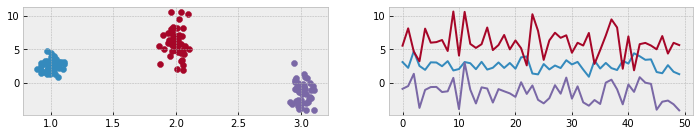
    


# Our toy data
We created 50 observations with some predefined relationship
Now let's examin how these are expressed in the different distance measures 


```python
 def plot_pdist(X,annot=True):
    fig,ax = plt.subplots(1,4,figsize=(12,2))
    for i,dist in zip(range(4),['cosine','euclidean','cityblock','correlation']):
        sns.heatmap(squareform(pdist(X.T,metric=dist)),ax=ax[i], annot=annot, fmt="0.2f")
        ax[i].set_title(dist)

```


```python
plot_pdist(X)
```


    
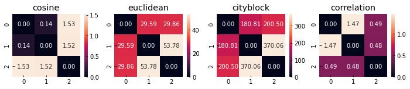
    


Let's scale all measures to the same range and see the effect on the different distnace measures


```python
from sklearn import preprocessing
x_normelized = preprocessing.scale(X)
plot_pdist(x_normelized)
```


    
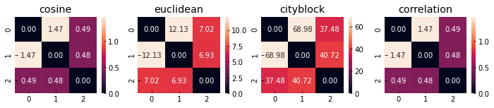
    


As you can see the correlation is the only one that is insensitive to the scale of the data, making it my preferred way of examining association (when I have strong evidence to believe a linear relationship is present)

# Overview of Clustering Techniques
You can perform clustering using many different approaches—so many, in fact, that there are entire categories of clustering algorithms. Each of these categories has its own unique strengths and weaknesses. This means that certain clustering algorithms will result in more natural cluster assignments depending on the input data. see https://link.springer.com/content/pdf/10.1007/s40745-015-0040-1.pdf for a good overview of most of these. 

# We will examine three common clustering algorithms today

- K-means - hard clustering of events based on distance from centers ([in-depth](https://scikit-learn.org/stable/modules/clustering.html#k-means))
- GaussianMixture - soft clustering of events based on per cluster gaussian distribution ([in-depth](https://scikit-learn.org/stable/modules/mixture.html#mixture))
- Hierarchical Clustering - hard clustering of events to multiple levels of hierarchy ([in-depth](https://scikit-learn.org/stable/modules/clustering.html#hierarchical-clustering))
<!-- - Bi-clustering - clustreing rows and columns at the same time
([in-depth](https://scikit-learn.org/stable/modules/generated/sklearn.cluster.SpectralBiclustering.html)) -->


```python
from sklearn.datasets import make_blobs
import pandas as pd
X, y = make_blobs(centers=5,n_samples=300,n_features=4, random_state=2020)
data = pd.DataFrame(X)
data['y'] = y
sns.pairplot(data,hue='y',palette='tab10')

```


    <seaborn.axisgrid.PairGrid at 0x7f23638d4be0>


    
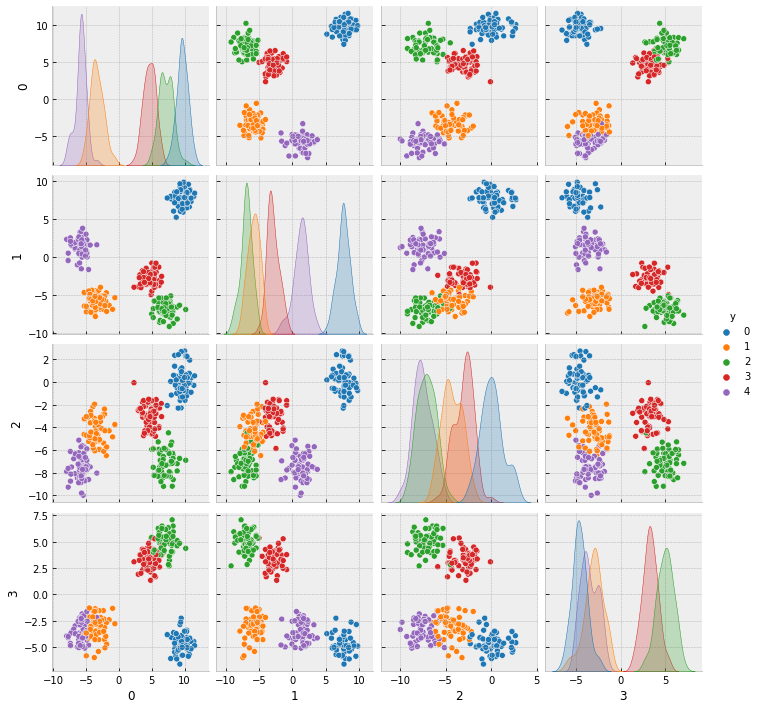
    


Le't start by examining the distance metrics for our fake data


```python
plot_pdist(X)
plot_pdist(X.T,False)
```


    
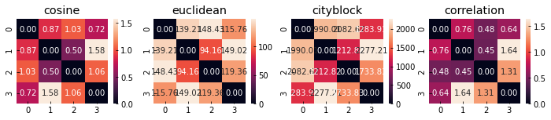
    


    
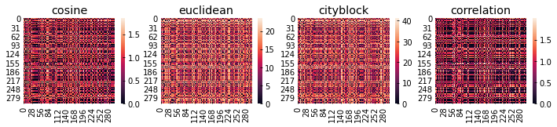
    


Now let's examine the observation matrix 


```python
from sklearn.cluster import KMeans,AgglomerativeClustering
from scipy.cluster import hierarchy
from sklearn.mixture import GaussianMixture
models = {"kmn" : KMeans(n_clusters=5),
          "gmm" : GaussianMixture(n_components=5),
          "hcl" : AgglomerativeClustering(n_clusters=5, affinity='euclidean', linkage='ward')}
results = {}
for key,mdl in models.items():
    results[key] = mdl.fit(X)
```


```python
f, ax = plt.subplots(1,4,figsize=(12, 4)) 
ax[0].scatter(x=X[:,1], y=X[:,2],cmap='tab10', c=y)
ax[0].set_title('source')
for i,key in enumerate(models.keys()):
    labels_ = results[key].labels_ if not key=='gmm' else results[key].fit_predict(X)
    ax[i+1].scatter(x=X[:,1], y=X[:,2],cmap='tab10', c=labels_)
    ax[i+1].set_title(key)
```


    
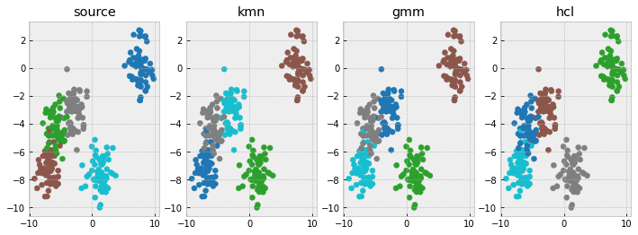
    


# What is happening under the hood?

1. The K-means algorithm iteratively imporves the position of centroids that minimise the within-cluster sum-of-squares criterion:
$$ \sum_{i=0}^{n}\min_{\mu_j \in C}(||x_i - \mu_j||^2) $$

1. The GaussianMixture model uses the expectation-maximization (EM) algorithm to fit k Gaussian models in the feature space. Each point is assigned a probability of association to all Gaussians in the space. The hard assignment is achieved using some cut (usually max).

1. The Agglomerative Clustering algorithm that recursively merges each pair of clusters that minimally increases a given linkage distance. In our case we are useing the ward linkage that minimizes the variance of the clusters being merged.

# What is their biggest limitation? 


```python
from sklearn.cluster import KMeans,AgglomerativeClustering
from scipy.cluster import hierarchy
from sklearn.mixture import GaussianMixture
k =3
models = {"kmn" : KMeans(n_clusters=k),
          "gmm" : GaussianMixture(n_components=k),
          "hcl" : AgglomerativeClustering(n_clusters=k, affinity='euclidean', linkage='ward')}
results = {}
for key,mdl in models.items():
    results[key] = mdl.fit(X)
```


```python
f, ax = plt.subplots(1,4,figsize=(12, 4)) 
ax[0].scatter(x=X[:,1], y=X[:,2],cmap='tab10', c=y)
ax[0].set_title('source')
for i,key in enumerate(models.keys()):
    labels_ = results[key].labels_ if not key=='gmm' else results[key].fit_predict(X)
    ax[i+1].scatter(x=X[:,1], y=X[:,2],cmap='tab10', c=labels_)
    ax[i+1].set_title(key)
```


    
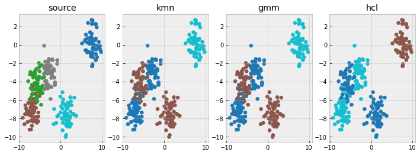
    


# How do we estimate K without domain knowledge?

When you're evaluating a clustering algorithm, it's a little more complicated than counting errors or calculating precision. Rather than looking at absolute values, it would be better to evaluate if this clustering distinguishes the data in ways that are similar to a ground truth set of classes or if it meets some requirement that members in the same class are more similar than members in different classes.

For a discussion on this important matter see [clustering-evaluation](https://scikit-learn.org/stable/modules/clustering.html#clustering-evaluation)

Here we will use two metrics to evaluate our clusters and "find" the right k
1. [Rand index adjusted for chance](https://scikit-learn.org/stable/modules/generated/sklearn.metrics.adjusted_rand_score.html#sklearn.metrics.adjusted_rand_score)
1. [mean Silhouette Coefficient](https://scikit-learn.org/stable/modules/generated/sklearn.metrics.silhouette_score.html#sklearn.metrics.silhouette_score)

# Rand index adjusted for chance
only relevant when you have the true labels of the dataset it measures the similarity of the real and the predicted assignments.
$$ ARI = (RI - Expected_RI) / (max(RI) - Expected_RI) $$
The adjusted Rand index will have a value close to 0.0 for random labeling independently of the number of clusters and samples and exactly 1.0 when the clusterings are identical.

# mean Silhouette Coefficient
If the ground truth labels are not known, evaluation must be performed using the model itself. The Silhouette Coefficient is such an evaluation, where a higher Silhouette Coefficient score relates to a model with better defined clusters. The Silhouette Coefficient is defined for each sample and is composed of two scores:

- a: The mean distance between a sample and all other points in the same class.
- b: The mean distance between a sample and all other points in the next nearest cluster.

The Silhouette Coefficient s for a single sample is then given as:
    
$$ s = \frac{b-a}{max(a,b)} $$

The Silhouette Coefficient for a set of samples is given as the mean of the Silhouette Coefficient for each sample. 

## Let us test this 


```python
from  sklearn.metrics import silhouette_score,adjusted_rand_score

score = np.zeros((9,2))
ss,ari = silhouette_score,adjusted_rand_score
for k in np.arange(2,11):
    mdl = AgglomerativeClustering(n_clusters=k, affinity='euclidean', linkage='ward').fit(X)
    y_hat = mdl.labels_
    score[k-2,:] = ss(X,y_hat),ari(y,y_hat)
```


```python
f, ax = plt.subplots(1,1,figsize=(12, 4)) 
ax.plot(score[:,0],label='silhouette_score')
ax.plot(score[:,1],label='adjusted_rand_score')
ax.plot(np.argmax(score[:,0])*np.array([1,1]),[0,1])
ax.legend()
```


    <matplotlib.legend.Legend at 0x7f236047af70>


    
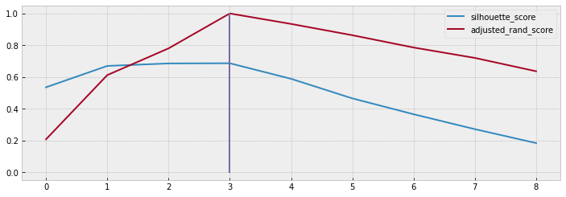
    


# What about real data?


```python
import numpy as np
import pandas as pd
import seaborn as sns
import matplotlib.pyplot as plt
import sys
from scipy.spatial.distance import squareform,pdist
from sklearn import preprocessing

sys.path.append("../")
from Code import preprocessing as pp
%load_ext autoreload
%autoreload 2
plt.style.use('bmh')
%matplotlib inline
```


```python
volume = pp.load('volume')
assc = volume.iloc[:,6:].corr()
_df = assc.apply(pp.missing_profile).T
retain = _df.index[_df['%missing']<0.9]
assc = assc.loc[retain,retain]
x = volume.iloc[:,6:]
x = x.loc[:,retain]
x_norm = preprocessing.scale(x)
```


```python
model = AgglomerativeClustering(n_clusters=6,  linkage='ward').fit(x_norm)
ix = np.argsort(model.labels_)
fig,ax = plt.subplots(figsize=(12,5))
im = ax.imshow(x_norm[ix,:].T,aspect='auto',vmin=-2,vmax=2,cmap='RdBu')
ax.grid(False)
plt.colorbar(im)
```


    <matplotlib.colorbar.Colorbar at 0x7f2362ffe850>


    
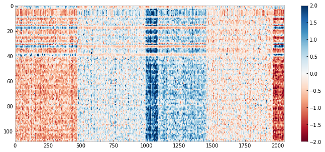
    


```python
row_d = np.corrcoef(x_norm)
col_d = np.corrcoef(x_norm.T)
fig,ax = plt.subplots(1,2,figsize=(12,5))
for i,dist in enumerate([row_d,col_d]):
    model = AgglomerativeClustering(n_clusters=6,  linkage='ward').fit(dist)
    ix = np.argsort(model.labels_)
    im = ax[i].imshow(dist[ix,:][:,ix],aspect='auto',cmap='RdBu')
    ax[i].grid(False)
    fig.colorbar(im, ax=ax[i])

```


    
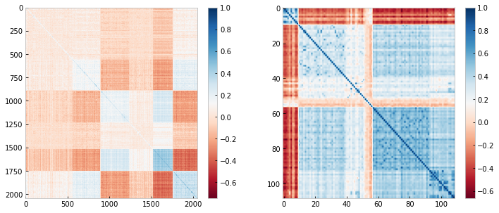
    


## Is this real? meaningful? useful? is this the correct k? 

That is your job to find out if you like at the end of course assignment or even before 
